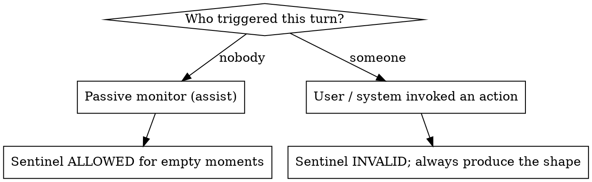

# Actions and Silence — the action catalogue, who triggers what, and silence as a lookup

An **action** is the output-shape axis of a composed prompt. The mode says who is speaking; the action says what must come out. Actions are few (a dozen), named, and each has three properties decided in code, not by the model: **trigger**, **silence permission**, and **voice relationship to the mode**.

## The catalogue (a production live-meeting copilot's set)

| Action | Trigger | May stay silent? | Output shape | Voice vs. mode |
|---|---|---|---|---|
| `assist` | **automatic** — fires as transcript rolls in (passive monitoring) | **yes** — emits the no-op sentinel for filler | brief observational help; answer only a clear question; capture a clear decision/risk in note modes | observer; never "say this" |
| `answer` | user (hotkey, typed chat, clicked question) | no | answer the newest question | live role mode → speak as the user; chat/explanatory mode → explain to the user |
| `what_to_say` | user (hotkey during a live call) | no | **only** the exact words to say next; no coaching, alternatives, labels, or quotation marks | always the mode's speaker, first person |
| `clarify` | user | no | the single most useful clarifying question | mode voice |
| `brainstorm` | user | no | several options, short | mode voice |
| `followup` | user ("shorter", "more formal", "add an example") | no | rewrite of the previous answer per the request, nothing else | keeps previous voice |
| `follow_up_questions` | user | no | 3 questions the user could ask | informational |
| `recap` | user | no | 3–5 bullets summarizing the conversation | informational |
| `code_hint` | user (screen capture of a problem) | no | hint/solution for the visible problem | coding contract applies |
| `title` | system (after a session) | no | 3–6 words | informational |
| `summary_json` | system (after a session) | no | a JSON document matching a parser's schema | informational — never re-prompted casually |
| `followup_email` | user | no | a short natural email | informational |

**Informational actions** (recap, title, summary_json, follow_up_questions, followup_email, clarify) produce *their shape* regardless of the mode's role voice. The voice contract says so explicitly: something like: "deliver this action's own format. Don't swap it for a spoken line in the mode's voice, and don't tack a spoken line onto it." Without that sentence a sales-mode recap comes back as a pitch.

## Why `assist`, `answer`, and `what_to_say` are three things

The action text differs by a few lines. The *product* difference is trigger + silence + voice:

```
                       assist              answer                  what_to_say
  trigger              nobody              the user                the user
  silence allowed      YES                 NO                      NO
  voice                observer            follows the mode        always first-person line
  failure guarded      noise               sentinel on request     coaching instead of the line
```

Worked example — the interviewer says: *"Yeah so, anyway, tell me about a time you disagreed with a manager."*

- **assist** (background): recognizes a real question → short note. Had the utterance been only "yeah, anyway, cool," it emits the sentinel and the overlay shows nothing.
- **what_to_say** (hotkey): `"Honestly, the clearest case was when my lead wanted to ship the migration in one cut…"` — words only.
- **answer** (typed in the chat panel, `readSurface` on): same question, but the user reads it, so a lead sentence plus two labelled points is allowed.

Why not one action with "be smart"? Measured failures in both directions: the model staying silent on an explicit request (scored "provides no assistance at all") and coaching ("you could say…") when the user needed the line. Separate actions let silence and voice be **looked up**, not inferred.

## Silence is a monitoring behaviour, not an action outcome

The single most valuable behaviour in passive monitoring is **not talking**: acknowledgements, transitions, scheduling chatter, two other attendees discussing their own task. Saying something nobody needed is worse than staying quiet. But the moment the user *deliberately* invokes an action, silence becomes the worst possible output.

So the boundary is a set, and the prompt block is generated from it:

```ts
const NO_ACTION = '[[NO_ACTION]]';
const SILENCE_ALLOWED: ReadonlySet<Action> = new Set(['assist']);

function silenceGate(action: Action): string {
  if (SILENCE_ALLOWED.has(action)) {
    return `<silence_gate>
You are listening, not being asked. First decide whether anyone needs you right now. Most moments in a
live call do not: acknowledgements, thanks, topic changes, scheduling talk, side conversations between
other attendees, or half-captured audio with nothing for the user to act on. For any of those, reply with
exactly ${NO_ACTION} and nothing more. Speaking when nobody needed you costs more than staying quiet.
The one exception is a turn that really is aimed at the user or needs their reply. Answer that one.
</silence_gate>`;
  }
  return `<silence_gate>
This turn was requested on purpose (hotkey, button, or typed command). Silence is not an option:
never answer with ${NO_ACTION}, even if another part of this prompt discusses staying quiet.
Thin material is not a reason to go quiet either. Give the best version of this action's output
that the material allows, or ask one well-chosen question.
</silence_gate>`;
}
```

Notice the second branch says *"overrides any mention of silence elsewhere"* — because the core or a mode block may still mention silence in passing, and prompt recency plus an explicit override beats hoping the model weighs them correctly.

### Tiny decision graph



## Suppressing the sentinel at every sink

Allowing a sentinel means owning it everywhere output can land:

| Sink | Check | Why |
|---|---|---|
| streaming gate | `couldBecomeSentinel(buffer)` — hold back a prefix like `[[NO_` until it resolves | partial sentinel must never paint |
| final output | `shouldSuppress(output)` → render nothing | the literal string is not an answer |
| session storage | suppress before persisting | silence must not become a "previous answer" that `followup` rewrites |
| mirror surfaces (phone, second window) | same suppress check | one forgotten sink shows `[[NO_ACTION]]` to the user |
| engine history | don't append | the model would see its own sentinel as conversation |

Provide `stripLeadingSentinel(text)` for the case where the model emits the sentinel *and then* an answer (it happens) — keep the answer, drop the prefix.

## Adding an action: checklist

1. Add the row to `ACTIONS` (3–6 lines: exactly what to produce).
2. Decide silence: add to `SILENCE_ALLOWED` only if the trigger is automatic.
3. Decide voice: add to `INFORMATIONAL` if its shape must win over the mode's role voice.
4. Decide surfaces: is it ever read rather than spoken? ever coding? (these are activations, not new actions)
5. Map the legacy constant (if migrating) so the `??` fallback still resolves.
6. Add the action to the behaviour-scenario fixture so the composer test pins its composition byte-for-byte.
